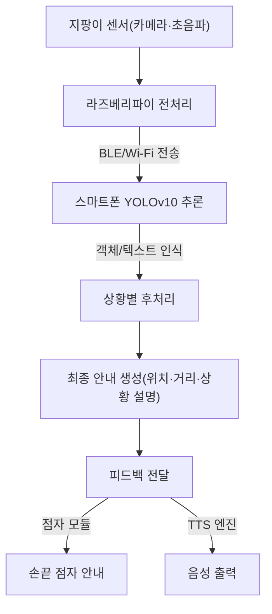
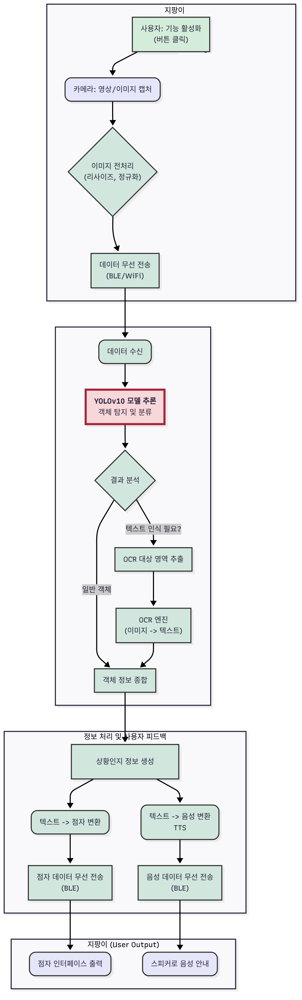
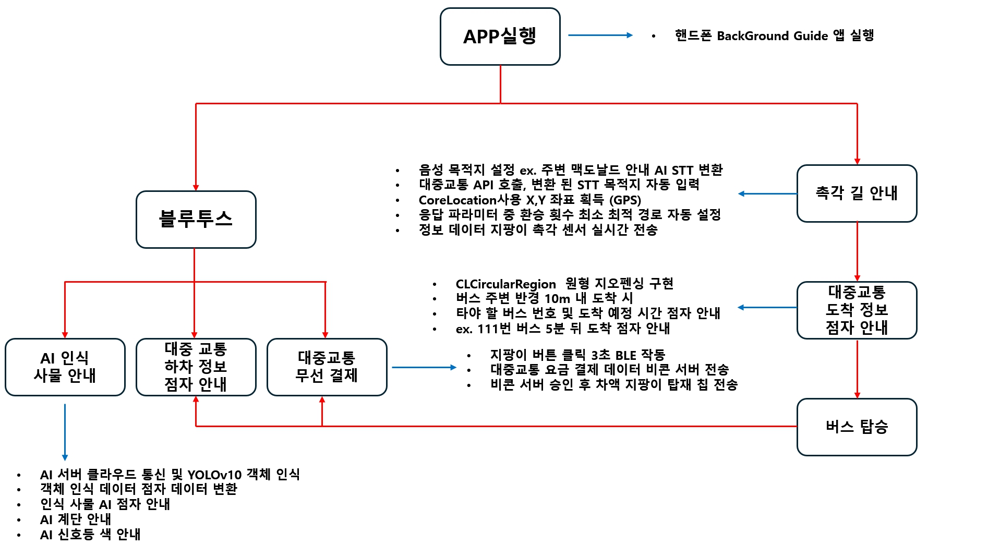
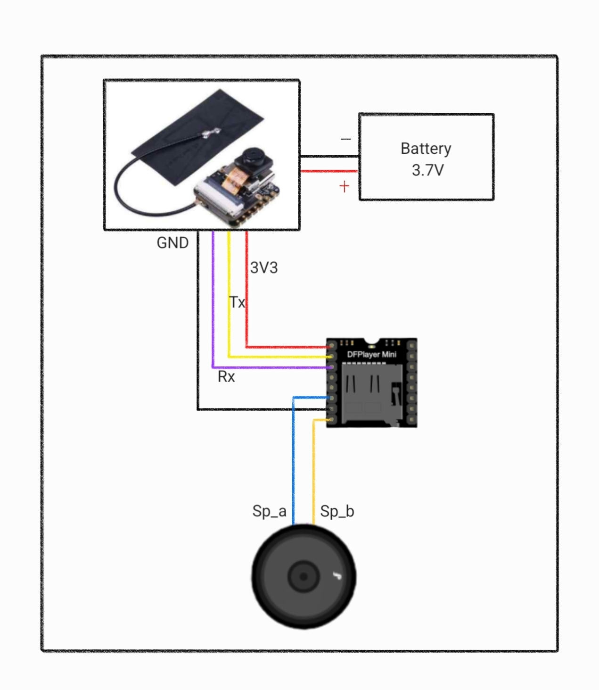
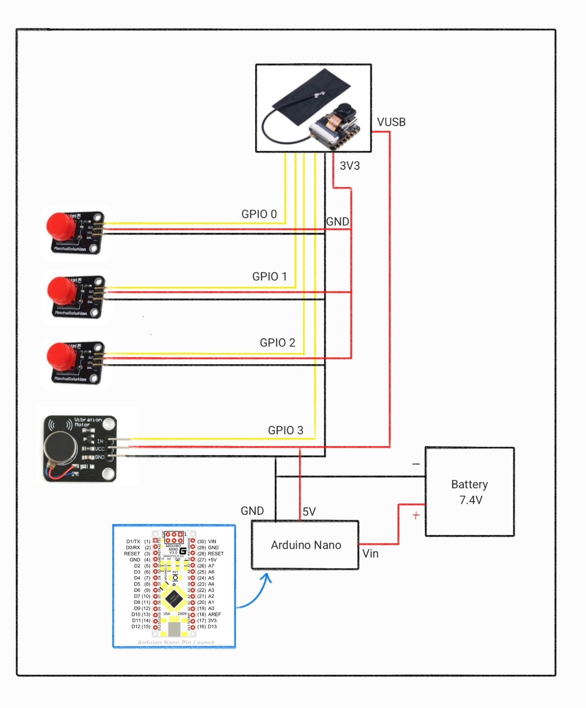

## 🤖 AI 시스템 아키텍처 & 기술 설명

### 1. 개요
본 **스마트 지팡이**는 최첨단 AI 기술을 활용하여 시각장애인의 보행 안전과 정보 접근성을 혁신적으로 향상시키는 것을 목표로 합니다.  
시스템의 심장부에는 **YOLOv10**이 탑재되어 있으며, 이는 **종단간(End-to-End) 실시간 객체 탐지**를 구현하여 지연 없는 안전한 보행 경험을 제공합니다.

> ✅ **핵심 특징**
- **NMS-Free 아키텍처** → 추론 병목 현상 제거
- **하이브리드 컴퓨팅** → 온보드 센서(카메라, 초음파) + 스마트폰 AP 활용
- **Latency-Throughput Trade-off 극복** → 속도·정확도·전력 효율을 동시에 달성

---

### 2. 핵심 AI 모델: YOLOv10 채택의 공학적 필연성
#### 🚀 NMS-Free 구조
- **기존 문제점**: NMS(Non-Maximum Suppression) 후처리 과정으로 인한 지연
- **혁신적 해결**: 훈련 단계에서 `Consistent Dual Assignments` 적용 → 추론 시 즉시 결과 도출
- **효과**: 예측 불가능한 수십 ms 지연 제거 → **위험 상황(계단, 장애물) 즉각 안내**

#### ⚡ 정확도-효율 동시 최적화
- **경량 분류 헤드 (Lightweight Head)** → FLOPs & 파라미터 감소, 배터리 소모 최소화
- **공간-채널 분리 다운샘플링** → 작은 신호등·간판·경계석도 정확히 탐지

---

### 3. AI 시스템 데이터 플로우



---

### 4. 단계별 동작

#### 🔹 1단계: 데이터 수집 및 온보드 처리 (지팡이)
- 카메라/초음파 센서 → 실시간 데이터 캡처  
- YOLOv10 입력 크기에 맞게 **리사이즈·정규화**

#### 🔹 2단계: YOLOv10 기반 추론 (스마트폰)
- End-to-End 추론 (0.1초 이내)  
- 결과: `[객체 종류, 신뢰도, 위치 좌표]`  
- OCR → 표지판/라벨 텍스트 추출

#### 🔹 3단계: 사용자 피드백 생성 (지팡이)
- 예: `"오른쪽에 아래로 내려가는 계단이 있습니다"`  
- **출력 모드**
  - 점자 모듈 → 손끝 안내  
  - TTS → 이어폰/스피커 음성 안내  

---

### ✨ 기대 효과
- **실시간 안전 보행** → 인지 지연 없는 위험 감지  
- **전력 효율 최적화** → 스마트폰/지팡이 사용 시간 증가  
- **정보 접근성 강화** → 작은 간판·텍스트까지 정확히 인식

## 📊 AI 시스템 아키텍처



---

## 🚌 스마트 지팡이 + 대중교통 안내 시스템

  


## 🗺️ TMap API 호출 예시 (JSON)

요청/응답을 그대로 다 보여주기엔 길기 때문에, 먼저 **핵심 요약**을 표로 보여주고  
원하면 클릭해서 **전체 JSON을 펼쳐볼 수 있게** 했습니다.

### 🔎 핵심 요약
| 항목 | 값 |
|---|---|
| 총 요금 | 1,500원 (KRW) |
| 총 소요 시간 | 14분 33초 (873초) |
| 총 거리 | 3.16 km (3,157 m) |
| 환승 횟수 | 0 |
| 도보 | 7분 42초 / 492 m |
| 버스 노선 | 간선:400 (`routeColor: #0068B7`) |
| 출발지 | 37.504585233865086, 127.02479803562213 |
| 도착지 | 37.479103923078995, 127.03747630119366 |

> JSONPath 참고  
> - 요금: `metaData.plan.itineraries[0].fare.regular.totalFare`  
> - 총 시간: `metaData.plan.itineraries[0].totalTime`  
> - 총 거리: `metaData.plan.itineraries[0].totalDistance`  
> - 도보(시간/거리): `metaData.plan.itineraries[0].totalWalkTime`, `totalWalkDistance`  
> - 버스 노선명: `...legs[?(@.mode=="BUS")].route`  
> - 경로 색상: `...legs[?(@.mode=="BUS")].routeColor`  
> - 출발/도착 좌표: `...legs[0].start`, `...legs[-1].end`

---
## ⚡ 하드웨어 연결 회로도

### 🎵 오디오 출력 회로 (DFPlayer Mini + 스피커)


---

### 🎮 버튼 + 진동 모터 제어 회로 (Arduino Nano)


---

### 📦 원본 JSON (펼쳐보기)
<details>
<summary><strong>전체 JSON 보기</strong></summary>

```json
{
  "metaData": {
    "requestParameters": {
      "busCount": 1,
      "expressbusCount": 0,
      "subwayCount": 0,
      "airplaneCount": 0,
      "locale": "ko",
      "endY": "37.479103923078995",
      "endX": "127.03747630119366",
      "wideareaRouteCount": 0,
      "subwayBusCount": 0,
      "startY": "37.504585233865086",
      "startX": "127.02479803562213",
      "ferryCount": 0,
      "trainCount": 0,
      "reqDttm": "20230808082843"
    },
    "plan": {
      "itineraries": [
        {
          "fare": {
            "regular": {
              "totalFare": 1500,
              "currency": {
                "symbol": "￦",
                "currency": "원",
                "currencyCode": "KRW"
              }
            }
          },
          "totalTime": 873,
          "legs": [
            {
              "mode": "WALK",
              "sectionTime": 400,
              "distance": 408,
              "start": { "name": "출발지", "lon": 127.02479803562213, "lat": 37.504585233865086 },
              "end": { "name": "지하철2호선강남역(중)", "lon": 127.02569444444444, "lat": 37.501725 },
              "steps": [
                { "streetName": "", "distance": 13, "description": "13m 이동", "linestring": "127.02481,37.504562 127.024666,37.50452" },
                { "streetName": "", "distance": 8, "description": "미스터도넛 신논현역점 에서 좌회전 후 8m 이동 ", "linestring": "127.024666,37.50452 127.02475,37.50451" }
                // ... (중략: 나머지 steps 동일)
              ]
            },
            {
              "routeColor": "0068B7",
              "distance": 2759,
              "start": { "name": "지하철2호선강남역(중)", "lon": 127.02569444444444, "lat": 37.501725 },
              "Lane": [{ "routeColor": "0068B7", "route": "간선:542", "routeId": "2247001", "service": 1, "type": 11 }],
              "type": 11,
              "mode": "BUS",
              "sectionTime": 411,
              "route": "간선:400",
              "routeId": "11504001",
              "service": 1,
              "passStopList": {
                "stationList": [
                  { "index": 0, "stationName": "지하철2호선강남역(중)", "lon": "127.025694", "lat": "37.501725", "stationID": "772608" }
                  // ... (중략)
                ]
              },
              "end": { "name": "일동제약사거리", "lon": 127.03824722222222, "lat": 37.47904722222222 },
              "passShape": { "linestring": "127.025675,37.501708 127.026528,37.499994 ..." }
            },
            {
              "mode": "WALK",
              "sectionTime": 62,
              "distance": 84,
              "start": { "name": "일동제약사거리", "lon": 127.03824722222222, "lat": 37.47904722222222 },
              "end": { "name": "도착지", "lon": 127.03747630119366, "lat": 37.479103923078995 },
              "steps": [
                { "streetName": "강남대로", "distance": 36, "description": "강남대로 을 따라 36m 이동", "linestring": "127.0381,37.479004 127.03806,37.4791 127.03799,37.479313" }
                // ... (중략)
              ]
            }
          ],
          "totalWalkTime": 462,
          "transferCount": 0,
          "totalDistance": 3157,
          "pathType": 2,
          "totalWalkDistance": 492
        }
      ]
    }
  }
}
```
</details>
---

## 📂 주요 코드 파일

- [CameraWebServer_mixtest.ino](./src/CameraWebServer_mixtest/CameraWebServer_mixtest.ino)  
- [app_httpd.cpp](./src/CameraWebServer_mixtest/app_httpd.cpp)  
- [board_config.h](./src/CameraWebServer_mixtest/board_config.h)
- [board_config.h](./src/CameraWebServer_mixtest/camera_index.h)
- [board_config.h](./src/CameraWebServer_mixtest/camera_pins.h)  


