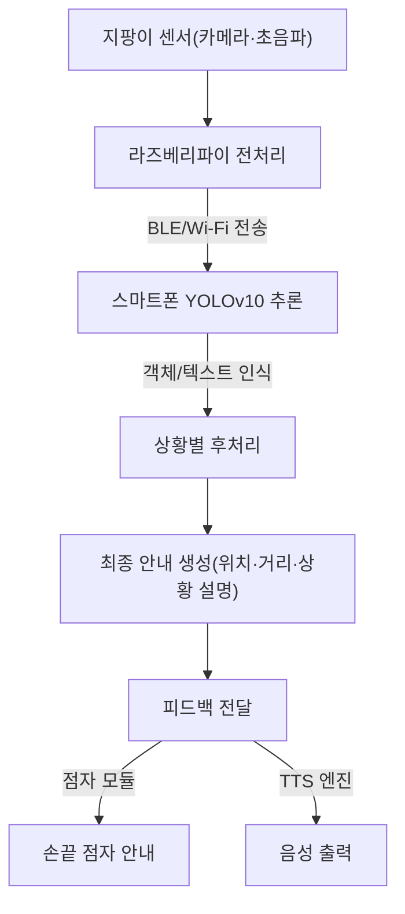

## 🤖 AI 시스템 아키텍처 & 기술 설명

### 1. 개요
본 **스마트 지팡이**는 최첨단 AI 기술을 활용하여 시각장애인의 보행 안전과 정보 접근성을 혁신적으로 향상시키는 것을 목표로 합니다.  
시스템의 심장부에는 **YOLOv10**이 탑재되어 있으며, 이는 **종단간(End-to-End) 실시간 객체 탐지**를 구현하여 지연 없는 안전한 보행 경험을 제공합니다.

> ✅ **핵심 특징**
- **NMS-Free 아키텍처** → 추론 병목 현상 제거
- **하이브리드 컴퓨팅** → 온보드 센서(카메라, 초음파) + 스마트폰 AP 활용
- **Latency-Throughput Trade-off 극복** → 속도·정확도·전력 효율을 동시에 달성

---

### 2. 핵심 AI 모델: YOLOv10 채택의 공학적 필연성
#### 🚀 NMS-Free 구조
- **기존 문제점**: NMS(Non-Maximum Suppression) 후처리 과정으로 인한 지연
- **혁신적 해결**: 훈련 단계에서 `Consistent Dual Assignments` 적용 → 추론 시 즉시 결과 도출
- **효과**: 예측 불가능한 수십 ms 지연 제거 → **위험 상황(계단, 장애물) 즉각 안내**

#### ⚡ 정확도-효율 동시 최적화
- **경량 분류 헤드 (Lightweight Head)** → FLOPs & 파라미터 감소, 배터리 소모 최소화
- **공간-채널 분리 다운샘플링** → 작은 신호등·간판·경계석도 정확히 탐지

---

### 3. AI 시스템 데이터 플로우

---

### 4. 단계별 동작

#### 🔹 1단계: 데이터 수집 및 온보드 처리 (지팡이)
- 카메라/초음파 센서 → 실시간 데이터 캡처  
- YOLOv10 입력 크기에 맞게 **리사이즈·정규화**

#### 🔹 2단계: YOLOv10 기반 추론 (스마트폰)
- End-to-End 추론 (0.1초 이내)  
- 결과: `[객체 종류, 신뢰도, 위치 좌표]`  
- OCR → 표지판/라벨 텍스트 추출

#### 🔹 3단계: 사용자 피드백 생성 (지팡이)
- 예: `"오른쪽에 아래로 내려가는 계단이 있습니다"`  
- **출력 모드**
  - 점자 모듈 → 손끝 안내  
  - TTS → 이어폰/스피커 음성 안내  

---

### ✨ 기대 효과
- **실시간 안전 보행** → 인지 지연 없는 위험 감지  
- **전력 효율 최적화** → 스마트폰/지팡이 사용 시간 증가  
- **정보 접근성 강화** → 작은 간판·텍스트까지 정확히 인식  
